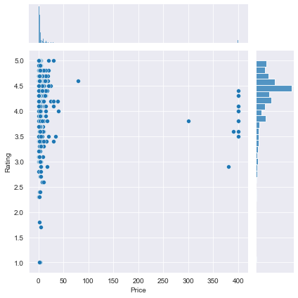
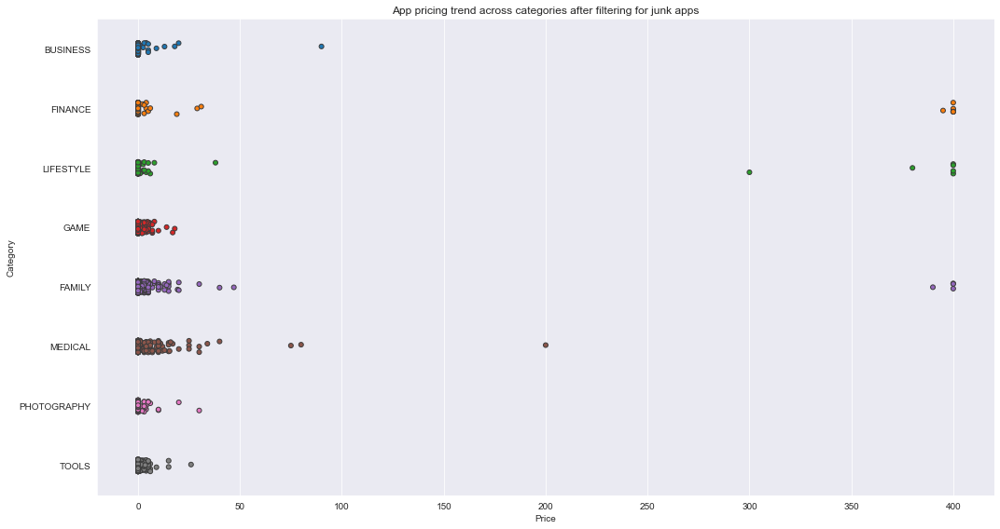

# About
A comprehensive analysis of the Android app market by comparing over ten thousand apps in Google Play across different categories using Pandas, Matplotlib, Seaborn, and Plotly. Looked for insights to devise strategies to drive growth and retention based on sentiment analysis of user reviews.

# Process
 - Data Cleaning
 - Correcting Data Types
 - Exploring App Categories
 - Distribution of app ratings
 - Size and Price of Apps
 - Relation between app catergory and app price
 - Filtering out 'junk' apps
 - Popularity of Paid apps vs Free apps
 - Sentiment Analysis of User Reviews
 
 # Graph Results
   
   
   
